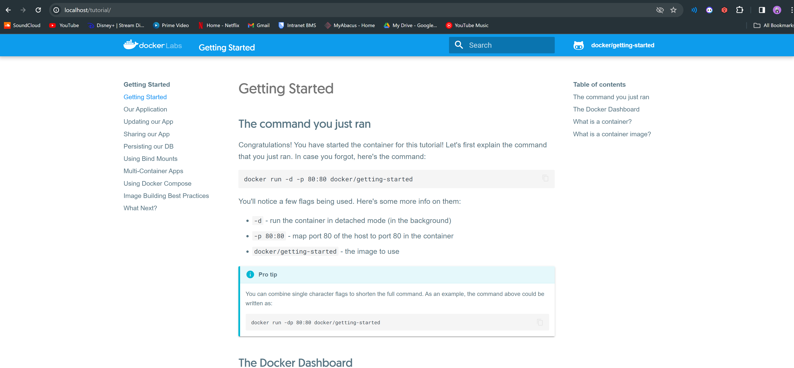
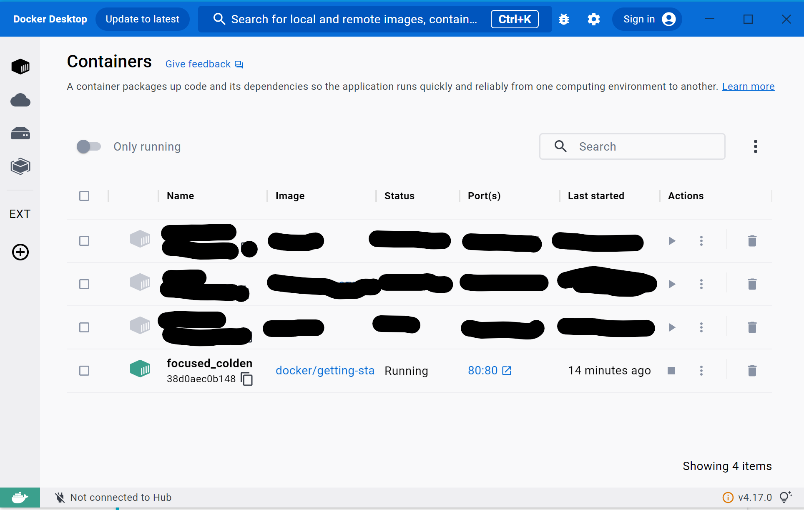

# KN01

## A

## B 

### Commands
docker -v
docker search
docker run -d(detach(im hintergrund laufen)) -p(Port mapping) 80:80 docker/getting-started
docker pull nginx
docker create -p 8081:80 nginx
docker start eager_babbage
docker run -d ubuntu
docker exec -it great_meninsky bin/bash
docker stop great_meninsky
docker rm $(docker ps -aq)
docker rmi $(docker images -q)

### Ubuntu
1. Nachdem ich den Command ausgeführt habe, hat der docker gemäkert, dass es keinen Image dafür findet. Es hat aber diesen image nacher automatisch gepulled.
2. Nachdem ich den Command ausgeführt habe, hat der docker nicht gemäkert. Es hat auch einen eigenen shell im cmd geöffnet für diesen docker.

## C

## D

### Commands
docker tag nginx:latest ch0ppper/m347:nginx
docker push ch0ppper/m347:nginx
(pushed das image auf den repo)

### Tags
In Docker ist ein "Tag" eine Bezeichnung, die Sie einem Docker-Image zuweisen, um es eindeutig zu identifizieren und zu verwalten.

