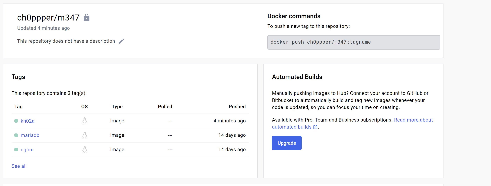
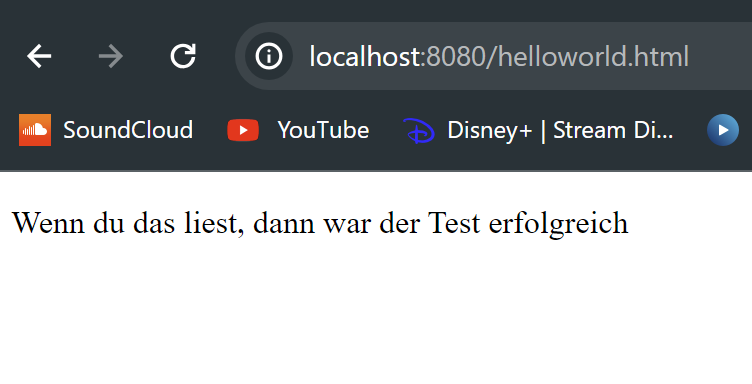
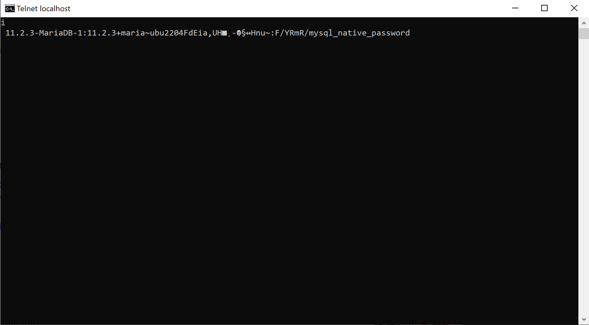
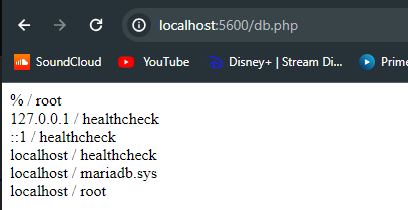
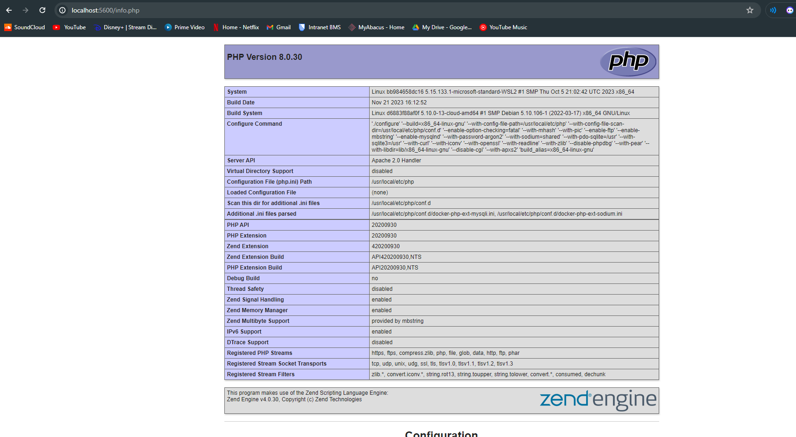

# KN02

## A

### Commands
docker build -t kn02a . \
docker tag kn02a ch0ppper/m347:kn02a \
docker push ch0ppper/m347:kn02a

## B

### Commands
docker build -t ch0ppper/m347:kn02bdb --file db.dockerfile . \
docker push ch0ppper/m347kn02bdb \
docker run --name kn02b-db -d -p 3306:3306 ch0ppper/m347:kn02bdb \
docker build -t ch0ppper/m347:kn02bweb --file web.dockerfile . \
docker push ch0ppper/m347:kn02bweb \
docker run --name kn02b-web -d -p 5600:80 --link kn02b-db ch0ppper/m347:kn02bweb \

[web dockerfile](web.dockerfile)
[db dockerfile](db.dockerfile)
[php db](db.php)
[php info](info.php)

