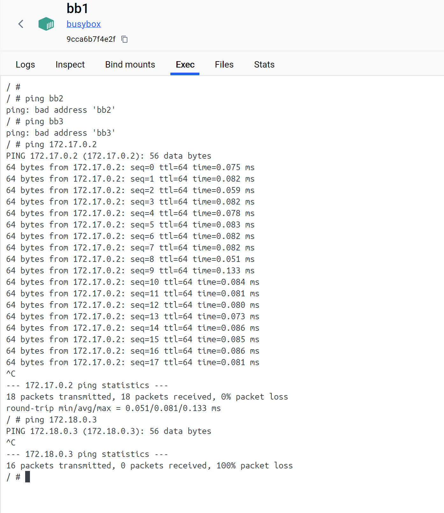
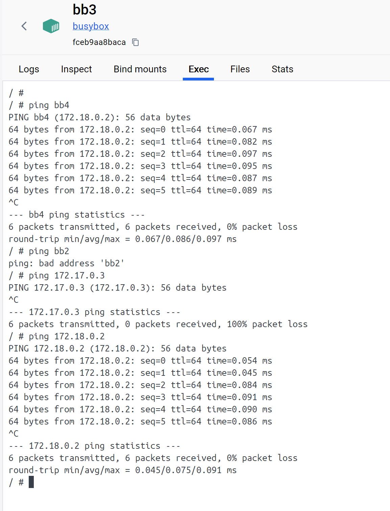

# KN03

## A

### Commands
docker network create -d bridge tbz \
docker run -itd --name=bb(1-2) busybox \
docker run -itd --network=tbz --name=bb(3-4) busybox \
docker inspect bb(x) \

### IP Addressen
1. 172.17.0.3
2. 172.17.0.2
3. 172.18.0.3
4. 172.18.0.2

### Gateways
1/2: 172.17.0.1
3/4: 172.18.0.1

### Busybox 1

### Busybox 4

### Explanations

Der Unterschied besteht darin, dass im Standard-Brückenmodus die Container teilweise miteinander verbunden sind, jedoch nur über die IP-Adresse, die sich im Laufe der Zeit ändern kann. Wenn ich jedoch mein eigenes Netzwerk erstelle, kann ich auch den Container-Namen verwenden, der konstant bleibt. \
In KN02 befanden sich die Container im gleichen Netzwerk-Gateway, konnten jedoch nicht direkt miteinander kommunizieren, indem sie einfach den Container-Namen verwendeten. Durch die Verwendung von Links wurde der Container-Name mit der IP-Adresse verknüpft, wodurch die Container effektiv miteinander kommunizieren konnten.
